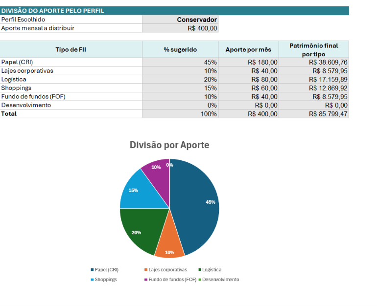
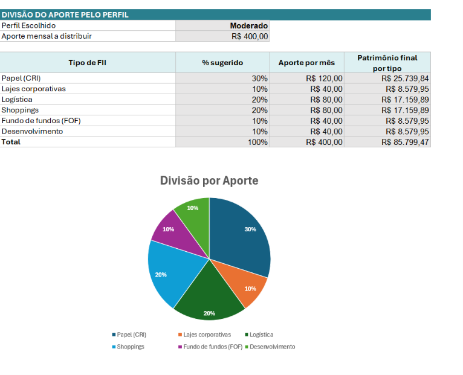
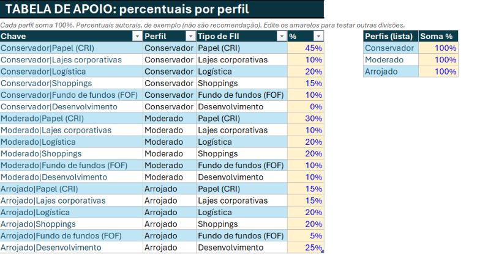

# FII Renda+ | Simulador de Renda Passiva

Este é um projeto desenvolvido em Excel para simular investimentos em Fundos Imobiliários (FIIs).

A ideia foi criar uma ferramenta simples onde o usuário pode informar o valor que pretende investir por mês, o prazo e as taxas utilizadas na simulação. A planilha então apresenta uma estimativa do patrimônio acumulado e dos dividendos mensais.

Também incluí três perfis de investidor: **Conservador, Moderado e Arrojado**. A escolha do perfil altera a distribuição do aporte entre os diferentes tipos de fundos.

## Como funciona

Na aba **Simulador**, o usuário preenche os campos de entrada e escolhe o perfil desejado.

A planilha calcula automaticamente:

* valor do patrimônio ao final do período;
* dividendos mensais estimados;
* total investido;
* projeções para diferentes períodos;
* uma estimativa de patrimônio para atingir uma determinada renda passiva.

Também há um gráfico mostrando como o aporte é dividido entre os tipos de fundos de acordo com o perfil escolhido.

## Exemplo

Foi utilizada uma simulação com:

* Salário: R$ 3.000,00
* Aporte mensal: R$ 400,00
* Prazo: 10 anos
* Retorno mensal: 0,90%
* Dividendos: 0,80% ao mês

Com esses valores, o patrimônio estimado ao final de 10 anos é de aproximadamente **R$ 85.799,47**, com dividendos estimados de **R$ 686,40 por mês**.

### Perfil Conservador

### Perfil Arrojado

A mudança de perfil altera principalmente a distribuição do dinheiro entre os tipos de fundos. O cálculo do patrimônio utiliza a mesma taxa de retorno informada na simulação.

## Tabela de apoio

A planilha possui uma aba com os percentuais utilizados em cada perfil.

Os percentuais foram definidos apenas para fins de estudo e não representam uma recomendação de investimento.

## Fórmulas

Foram utilizadas algumas funções do Excel para realizar os cálculos, principalmente:

* VF, para calcular o valor futuro dos aportes;
* PGTO, para estimar o aporte necessário para uma determinada meta;
* NPER, para estimar o tempo necessário para atingir uma meta;
* PROCV, para buscar os percentuais de acordo com o perfil escolhido.

Também foram utilizados recursos como lista suspensa, tabela, gráfico e intervalos nomeados.

## Limitações

A simulação utiliza taxas fixas para facilitar os cálculos. Na prática, os rendimentos dos FIIs variam ao longo do tempo.

Também não foram considerados fatores como impostos, corretagem ou variação do preço das cotas.

Por isso, os resultados servem apenas como **estimativa para fins educacionais**.

## Arquivos

O projeto contém:

* `FII_Renda_Mais_Simulador.xlsx` – planilha principal;
* `prints` – imagens utilizadas para mostrar o funcionamento da ferramenta.
